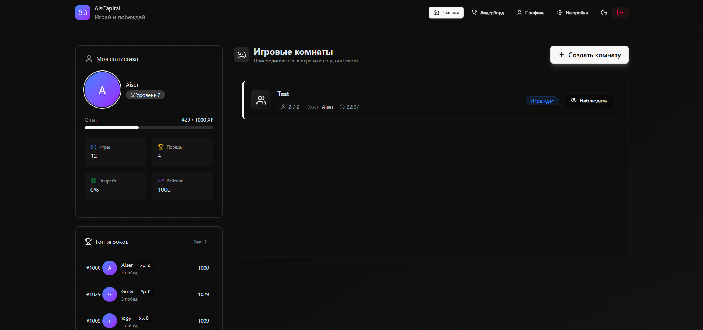
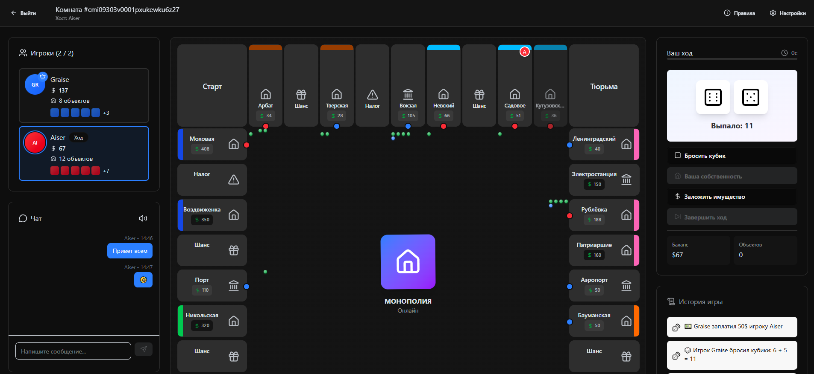
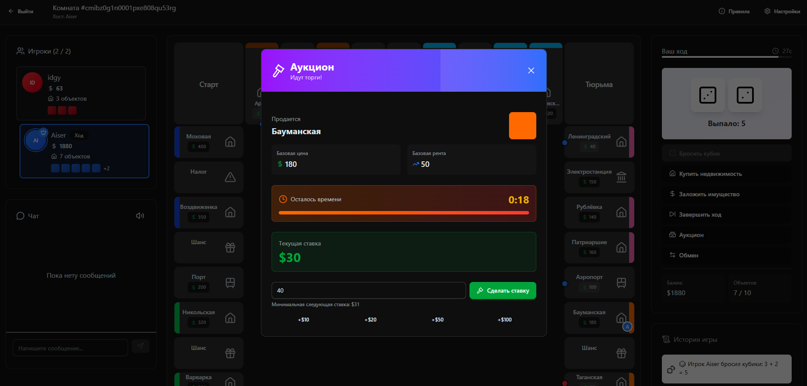
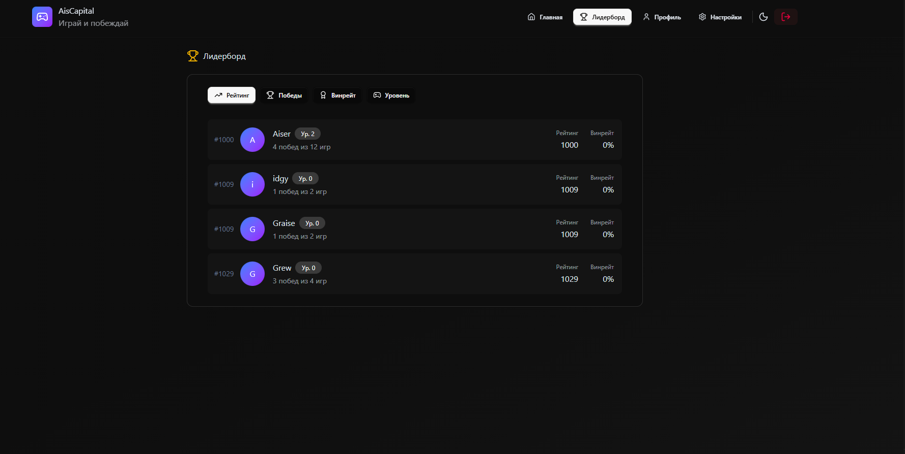
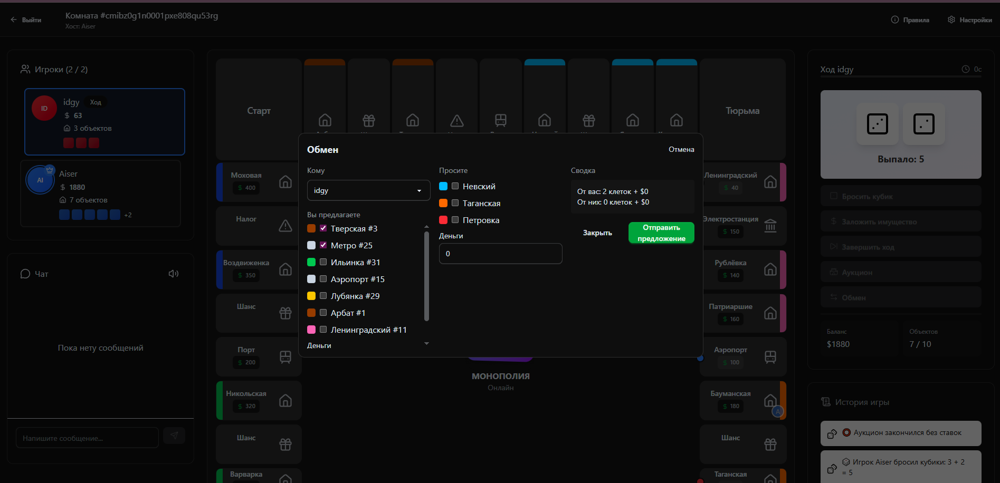

# Ais|Capital Monopoly Online - MVP 🏠🎲


[](https://nodejs.org/)
[](https://www.typescriptlang.org/)
[](https://reactjs.org/)
[](https://vitejs.dev/)
[](https://www.postgresql.org/)
[](https://www.prisma.io/)
[](https://socket.io/)
[](https://www.docker.com/)

Коротко: это онлайн-версия классической игры «Монополия», реализованная как MVP с мультиплеером и realtime-синхронизацией. Игроки создают комнаты, торгуются, покупают недвижимость, участвуют в аукционах и обменах, а также общаются в чате.

Проект предназначен для демонстрации полного end-to-end TypeScript-стека и рабочих мультиплеерных механик.

**Ключевые возможности**

- Игровые комнаты
	- Создание приватных комнат с паролем
	- Присоединение к публичным комнатам
	- До 6 игроков в комнате

- Полная механика Монополии
	- Покупка недвижимости и расчёт ренты
	- Аукционы и обмены между игроками
	- Клетки «Шанс», тюрьма, налоговые клетки
	- Логирование действий для прозрачности

- Реалтайм и мультиплеер
	- Socket.IO для мгновенной синхронизации
	- Встроенный чат

- Лидерборд и статистика
	- Учет побед, поражений, винрейт и рейтинга

**Техническая реализация**

- Frontend: React + Vite + TypeScript
- Backend: Node.js + TypeScript + Socket.IO
- База данных: PostgreSQL (через Prisma)
- Аутентификация: JWT (сервер принимает все игровые решения)
- Контейнеризация: Docker + docker-compose

**Скриншоты**

Скриншоты интерфейса находятся в папке `docs/`. Примеры:

- 
- 
- 
- 
- 

## Быстрый старт (Docker)

Запустить проект локально через Docker — самый быстрый и надёжный способ:

```powershell
git clone https://github.com/AiserKz/AisCapital.git
cd AisCapital
docker-compose up --build
```

- Сервер доступен: `http://localhost:5000`
- Фронтенд доступен: `http://localhost:5173`

> Примечание: если на хосте уже запущен PostgreSQL, можно сделать `.env` в `backend/` и указать `DATABASE_URL` для локального подключения (см. `docker-compose.yml`).

## Локальная разработка

1. Backend

```powershell
cd backend
npm install
# при локальной БД создайте .env с данными как в .env.local
npm run dev
```

2. Frontend

```powershell
cd frontend
npm install
npm run dev
```

---

## Архитектура

* **Сервер** отвечает за всю игровую логику, синхронизацию и валидацию действий игроков.
* **Frontend** - визуализация и отправка команд на сервер (через REST + WebSocket).
* **Prisma** - управление моделью данных: игроки, комнаты, история игр, состояние клеток.

---

## Контакты

* Telegram: [@aisblack](https://t.me/aisblack)
* Email: [aibekmiribekov0217@gmail.com](mailto:aibekmiribekov0217@gmail.com)

---

## Сообщение о багах

Если вы нашли баг или хотите предложить улучшение:

1. Создайте **Issue** в этом репозитории на GitHub.
2. Укажите подробности: шаги воспроизведения, скриншоты (если нужно), и описание ожидаемого поведения.
3. Все предложения и баги приветствуются!

---

## Лицензия

Этот проект лицензирован под **Apache License 2.0**.

Вы можете использовать, копировать, модифицировать и распространять проект в соответствии с условиями лицензии. При публикации производных работ указывайте автора.

[Полный текст лицензии Apache 2.0](https://www.apache.org/licenses/LICENSE-2.0)


